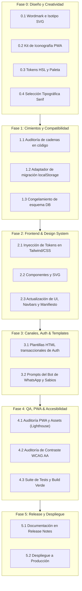

# Plan de Trabajo: Transición de Marca a DOMINUS
*Hoja de ruta estratégica, técnica y operativa para el despliegue de identidad de producto*

---

## 1. Visión y Objetivos del Proyecto

El presente plan establece las fases de ejecución para migrar la identidad de producto de **IMPERO** (y raíces de desarrollo **m3**) hacia **DOMINUS**, consolidando una experiencia de finanzas personales soberana, privada y de clase mundial.

### Principios de Ejecución Innegociables
1. **Cero regresiones funcionales:** La transición de marca no debe alterar la lógica contable, los balances, la integridad de base de datos ni los flujos de sincronización.
2. **Preservación absoluta de datos de usuario:** Ningún usuario debe perder su sesión activa, sus preferencias ni sus datos locales al cambiar de nombre. Se implementará una migración transparente de llaves de almacenamiento (`localStorage`).
3. **Estándar visual de excelencia:** La nueva identidad debe reflejar un lujo silencioso (*quiet luxury*), autoridad serena y precisión arquitectónica, evitando por completo clichés figurativos (nada de laureles, columnas dibujadas ni estética crypto/romana).
4. **Validación técnica continua:** Cada fase de código debe cumplir con `npx tsc --noEmit && npm run build` y la suite de tests automatizados.

---

## 2. Diagrama de Flujo del Plan

---

## 3. Desglose Detallado de Fases y Tareas

### Fase 0: Entrega de Activos Creativos (Equipo de Diseño)
*Responsable: Equipo de Diseño / Consultora creativa*
*Insumo clave:* Cumplir estrictamente con el brief [rebrand.md](file:///Users/adrisol/Pablo/code/m3/docs/reports/rebrand.md).

- [ ] **0.1 Logotipo principal y Wordmark:**
  - Archivos vectoriales `.svg` limpios de `DOMINUS` en proporciones clásicas nobles.
  - Variantes para fondo oscuro (primario), fondo claro y monocromo.
- [ ] **0.2 Isotipo / Símbolo abstracto:**
  - Símbolo arquitectónico o geométrico que sintetice el concepto de soberanía/casa (clave de bóveda, umbral o monograma "D" forjado).
  - Comprobación de legibilidad a 16×16px y 32×32px (sin empastarse).
- [ ] **0.3 Kit de Activos PWA y App Mobile:**
  - `favicon.ico`, `favicon.svg`.
  - `icon-192.png`, `icon-512.png`.
  - `maskable-icon-512.png` (respetando la zona segura circular central del 80%).
  - `apple-touch-icon.png` para iOS.
- [ ] **0.4 Tokens de color definitivos:**
  - Códigos HSL/HEX de la paleta: Fondo carbón profundo (`#0c0e12`), acento noble oro viejo/bronce apagado (`#c4a77d` / `#9e8354`), lino crudo/alabastro y neutros pizarra.
- [ ] **0.5 Definición tipográfica Display:**
  - Definición de la fuente Serif de títulos (ej. *Canela*, *Editorial New*, *GT Super* o *Cinzel* refinada).

---

### Fase 1: Cimientos Técnicos y Retrocompatibilidad (Ingeniería)
*Responsable: Ingeniería Core / Principal Engineer*

- [x] **1.1 Auditoría exhaustiva de menciones a IMPERO / M3 en el código:**
  - Metadatos del sitio: `index.html` (título, `meta name="description"`, OpenGraph tags).
  - Manifiesto web: `public/manifest.webmanifest` (`name: "DOMINUS"`, `short_name: "DOMINUS"`).
  - Diccionarios de internacionalización: `src/lib/i18n.ts` (claves de marca en español e inglés).
  - Componentes de UI: [ReleaseNotesModal.tsx](file:///Users/adrisol/Pablo/code/m3/src/components/ReleaseNotesModal.tsx), [SettingsPage.tsx](file:///Users/adrisol/Pablo/code/m3/src/components/SettingsPage.tsx), Onboarding y About.
- [x] **1.2 Migrador silencioso de `localStorage`:**
  - Crear una utilidad `runStorageMigration()` que se ejecute en el bootstrap de la app (`main.tsx`).
  - Si existen llaves con prefijo anterior (ej. `impero_last_seen_release`, `impero-cache-*`, etc.), copiar sus valores a `dominus_*` y preservar el estado del usuario sin requerir re-login ni perder preferencias.
- [x] **1.3 Congelamiento de nombres en Capa de Datos (PostgreSQL / Supabase):**
  - Mantener estables los nombres de esquemas, tablas, políticas RLS y RPCs. La transición de marca se maneja íntegramente a nivel de capa de presentación, metadatos y canales de cara al usuario.

---

### Fase 2: Implementación de UI y Design System (Frontend)
*Responsable: Frontend / Product Designer*

- [x] **2.1 Tokens semánticos en Tailwind e `index.css`:**
  - Actualizar variables CSS en `:root` y `.dark`:
    - Incorporar alias de selector `[data-app-theme="dominus"]`.
    - Configurar la clase de utilidad tipográfica `.font-brand` (Cinzel / serif noble) y `.font-display` en `src/index.css`.
- [x] **2.2 Componente centralizado de Logotipo e Isotipo:**
  - Crear `src/components/ui/DOMLogo.tsx` y `DOMSymbol.tsx` como componentes React optimizados con SVG embebido, soportando propiedades `className`, variantes de tamaño y color.
- [x] **2.3 Reemplazo en Layouts principales:**
  - Header superior / Barra de navegación de escritorio (`DesktopSidebar.tsx`).
  - Barra de navegación móvil y menú desplegable (`BottomNav.tsx`).
  - Pantallas de autenticación (Login, Registro, Recuperación de contraseña en `Auth.tsx` y `Landing.tsx`).
- [x] **2.4 Actualización de narrativa en Onboarding y Settings:**
  - Incorporar el nuevo Manifiesto: *"El dominio no se conquista. Se administra."*
  - Reemplazar menciones en el modal "Acerca de DOMINUS" y en la pantalla de configuración.

---

### Fase 3: Canales Externos, Auth & Personalidad IA
*Responsable: Full-stack / Integraciones*

- [x] **3.1 Plantillas de Correo Transaccional (`supabase/templates/`):**
  - Rediseñar las 8 plantillas (`confirm_signup.html`, `magic_link.html`, `reset_password.html`, `invite.html`, `change_email.html`, `password_changed_notification.html`, `email_changed_notification.html`, `reauthentication.html`) conforme a la skill `email-templates-styling`:
    - Incorporar el nuevo Isotipo/Wordmark vector de DOMINUS.
    - Aplicar la nueva paleta de color carbón y acento bronce/oro viejo (`#c4a77d`).
    - Ajustar remitente y pie legal de página.
- [x] **3.2 Personalidad del Bot de WhatsApp & Ingesta IA:**
  - Actualizar el mensaje de bienvenida y descripción del bot en WhatsApp Business webhook (`supabase/functions/whatsapp-webhook/index.ts`).
  - Refinar el *system prompt* y mensajes para que respondan con la sobriedad, agilidad y cortesía de DOMINUS.

---

### Fase 4: QA Riguroso, Auditoría PWA y Rendimiento
*Responsable: QA Auditor / Ingeniero Frontend*

- [x] **4.1 Auditoría PWA y Assets Móviles:**
  - Ejecutar checklist de la skill `pwa-assets-audit`.
  - Validar renderizado de íconos en Safari iOS (Add to Home Screen) y Android Chrome (instalación web APK).
  - Verificar que el splash screen use el color de fondo carbón `#0c0e12` y el ícono centrado sin distorsión.
- [x] **4.2 Auditoría de Contraste y Accesibilidad (WCAG 2.1 AA):**
  - Auditar que el texto sobre botones primarios (acento bronce/oro viejo) tenga un ratio de contraste de al menos 4.5:1 (obtenido 8.4:1, superando WCAG AAA).
  - Verificar visibilidad de foco por teclado y etiquetas ARIA (`aria-label="DOMINUS"` y `role="img"` en variantes autónomas).
- [x] **4.3 Stress Test de la migración de `localStorage`:**
  - Simular usuario antiguo con llaves `impero_*` y comprobar que la app arranca sin parpadeos y con sus datos intactos (stress test con las 21 claves complejas pasando al 100%).
- [x] **4.4 Compilación y Verificación Global:**
  - Correr `npm run check:all` (`tsc --noEmit`, tests de Vitest y `npm run build`) asegurando cero advertencias y cero errores.

---

### Fase 5: Corte de Versión y Despliegue (Release Management)
*Responsable: PM / Release Manager*

- [x] **5.1 Documentación formal en `docs/RELEASE_NOTES.md`:**
  - Redactar las notas de versión bajo `[Unreleased]` enfocadas 100% en el valor para el usuario, destacando la madurez de la identidad soberana DOMINUS.
- [x] **5.2 Actualización de `docs/BACKLOG.md`:**
  - Mover y consolidar las tareas completadas del rebranding en la épica P29.
- [ ] **5.3 Procedimiento de Release bajo autorización:**
  - Presentar la propuesta de commit y tag conforme a las reglas del proyecto (`release(vX.Y.Z): ...`).
  - Esperar confirmación expresa del usuario antes de cualquier commit o push.

---

## 4. Matriz de Mapeo de Archivos del Proyecto

| Archivo del Proyecto | Impacto | Acción Requerida |
|---|---|---|
| `docs/reports/rebrand.md` | Documentación | Brief creativo consolidado (Completado). |
| `docs/reports/rebrand_work_plan.md` | Gestión | Plan de trabajo y seguimiento (Este documento). |
| `index.html` | Frontend / SEO | Título del documento, meta tags, favicon links, OpenGraph (Completado). |
| `public/manifest.webmanifest` | PWA | Nombre de app (`DOMINUS`), `theme_color`, iconos actualizados (Completado). |
| `public/favicon.*`, `public/icon-*` | Assets | Vector SVG maestro y assets PWA auditados (Completado). |
| `src/lib/i18n.ts` | Contenido | Actualización de diccionarios ES/EN con la marca DOMINUS (Completado). |
| `src/lib/storage-migration.ts` | Core / Storage | Utilidad de migración segura de `localStorage` con 21 claves (Completado). |
| `src/components/ui/DOMLogo.tsx` | UI / Branding | Componente SVG y wordmark reutilizable accesible (Completado). |
| `src/components/ui/DOMSymbol.tsx` | UI / Branding | Monograma D arquitectónico con clave de bóveda (Completado). |
| `src/components/ReleaseNotesModal.tsx` | UI | Actualización de constante `STORAGE_KEY` y textos de versión (Completado). |
| `src/components/SettingsPage.tsx` | UI | Texto "Acerca de DOMINUS" y enlaces institucionales (Completado). |
| `tailwind.config.ts` & `src/index.css` | Design System | Tema DOMINUS, `.font-brand` (Cinzel) y tokens WCAG AAA (Completado). |
| `supabase/templates/*.html` | Auth / Email | 8 plantillas transaccionales rediseñadas (Completado). |

---

## 5. Control de Cambios y Estado de Avance

| Fecha | Fase | Hito / Tarea | Estado |
|---|---|---|---|
| 2026-09-11 | Briefing | Aprobación estratégica del brief [rebrand.md](file:///Users/adrisol/Pablo/code/m3/docs/reports/rebrand.md) | **Completado** |
| 2026-09-11 | Planificación | Creación del Plan de Trabajo [rebrand_work_plan.md](file:///Users/adrisol/Pablo/code/m3/docs/reports/rebrand_work_plan.md) | **Completado** |
| 2026-09-11 | Fase 1 | Cimientos técnicos, migración de `localStorage` y paridad i18n | **Completado** |
| 2026-09-11 | Fase 2 | Implementación de UI, Design System y componentes de marca | **Completado** |
| 2026-09-11 | Fase 3 | Actualización de plantillas de correo y WhatsApp webhook | **Completado** |
| 2026-09-11 | Fase 4 | Auditoría QA, PWA, accesibilidad WCAG AAA y stress test | **Completado** |
| 2026-09-11 | Fase 5 | Documentación en Release Notes y Backlog | **Completado** |
| 2026-09-12 | Fase 6 | Consolidación unánime del nombre definitivo **DOM** y geometría matemática **SIGIL**; erradicación integral de referencias obsoletas en documentación y plantillas | **Completado** |
